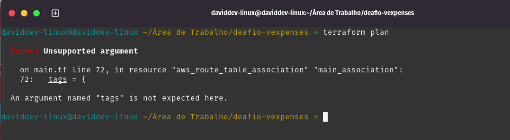
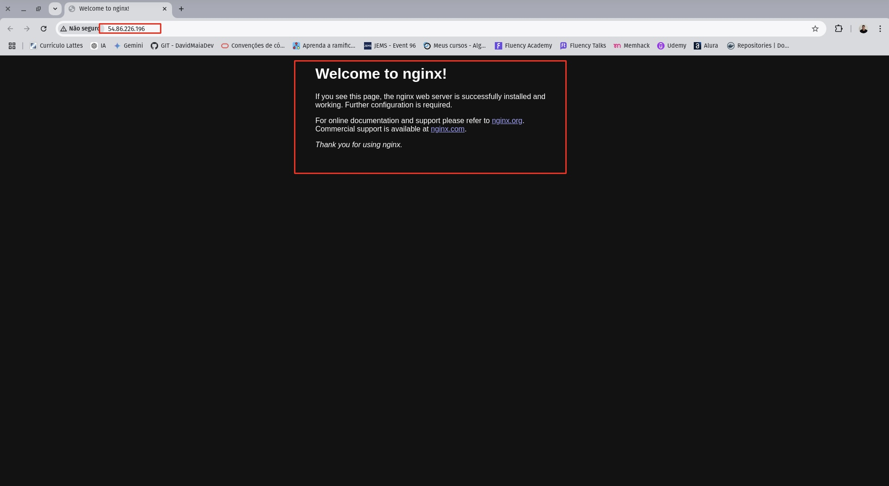

# Desafio Online da VExpenses - Processo Seletivo para Estágio em DevOps

## Objetivo

Este repositório contém a minha solução do desafio de infraestrutura como código (IaC) usando **Terraform**. Conforme solicitado e explicado no processo seletivo da VExpenses, o objetivo é demonstrar habilidades em automação, segurança e configuração de servidores, usando recursos da AWS para provisionamento de uma infraestrutura básica. Veja tudo o que fiz:

## Descrição Técnica e Curiosidade

Resumindo, o arquivo **main.tf** contém o código Terraform que provisiona os seguintes recursos na **AWS**. O código se parece bastante com o de um projeto que fiz a um tempo. Caso deseje ver, só seguir este link: https://gitlab.com/DavidMaiaDev/projeto-phoebus-devops-david

# Vamos ao entendimento do arquivo: _Análise Técnica do Código Terraform - (Tarefa 1)_

### Provedor AWS

Define a **região AWS** como us-east-1 para o provisionamento dos recursos.

```bash
provider "aws" {
  region = "us-east-1"
}
```

### Variáveis de Projeto

Variáveis usadas são para parametrizar o nome do projeto (VExpenses) e o nome do candidato (Que nesse caso, irei colocar o meu). Estas variáveis são utilizadas em vários recursos, facilitando a identificação desses recursos.

```bash
variable "projeto" {
  description = "Nome do projeto"
  type        = string
  default     = "VExpenses"
}

variable "candidato" {
  description = "Nome do candidato"
  type        = string
  default     = "SeuNome"
}
```

### Chave SSH

Uma chave privada é gerada com o algoritmo RSA de 2048 bits, que é usada para criar um Key Pair na AWS. A chave pública associada será usada para acessar a instância EC2 via SSH.

```bash
resource "tls_private_key" "ec2_key" {
  algorithm = "RSA"
  rsa_bits  = 2048
}

resource "aws_key_pair" "ec2_key_pair" {
  key_name   = "${var.projeto}-${var.candidato}-key"
  public_key = tls_private_key.ec2_key.public_key_openssh
}
```

### Criação de VPC

A VPC é criada com o bloco CIDR 10.0.0.0/16 para suportar até 65.536 endereços IP. Pelo que vi, o suporte a DNS e hostnames está habilitado.

```bash
resource "aws_vpc" "main_vpc" {
  cidr_block           = "10.0.0.0/16"
  enable_dns_support   = true
  enable_dns_hostnames = true

  tags = {
    Name = "${var.projeto}-${var.candidato}-vpc"
  }
}
```

### Subnets

Uma sub-rede associada à VPC é criada no bloco CIDR 10.0.1.0/24 (256 endereços IP) na zona de disponibilidade "us-east-1a".

```bash
resource "aws_subnet" "main_subnet" {
  vpc_id            = aws_vpc.main_vpc.id
  cidr_block        = "10.0.1.0/24"
  availability_zone = "us-east-1a"

  tags = {
    Name = "${var.projeto}-${var.candidato}-subnet"
  }
}
```

### Internet Gateway e Tabela de Rotas

Uma Internet Gateway é criada para permitir acesso à internet. A Tabela de Rotas é configurada com uma rota padrão para todo o tráfego de saída (0.0.0.0/0) via o Internet Gateway.

```bash
resource "aws_internet_gateway" "main_igw" {
  vpc_id = aws_vpc.main_vpc.id

  tags = {
    Name = "${var.projeto}-${var.candidato}-igw"
  }
}

resource "aws_route_table" "main_route_table" {
  vpc_id = aws_vpc.main_vpc.id

  route {
    cidr_block = "0.0.0.0/0"
    gateway_id = aws_internet_gateway.main_igw.id
  }

  tags = {
    Name = "${var.projeto}-${var.candidato}-route_table"
  }
}

resource "aws_route_table_association" "main_association" {
  subnet_id      = aws_subnet.main_subnet.id
  route_table_id = aws_route_table.main_route_table.id
}
```

### Grupos de Segurança

Um Security Group aqui é criado para controlar o tráfego da instância EC2 que vai ser iniciada:

**Entrada:** Permite conexões SSH (porta 22) de qualquer endereço IP. (Algo que não me parece ser tão seguro)

**Saída:** Permite todo o tráfego de saída.

```bash
resource "aws_security_group" "main_sg" {
  name        = "${var.projeto}-${var.candidato}-sg"
  description = "Permitir SSH de qualquer lugar e todo o tráfego de saída"
  vpc_id      = aws_vpc.main_vpc.id

  ingress {
    description      = "Allow SSH from anywhere"
    from_port        = 22
    to_port          = 22
    protocol         = "tcp"
    cidr_blocks      = ["0.0.0.0/0"]
    ipv6_cidr_blocks = ["::/0"]
  }

  egress {
    description      = "Allow all outbound traffic"
    from_port        = 0
    to_port          = 0
    protocol         = "-1"
    cidr_blocks      = ["0.0.0.0/0"]
    ipv6_cidr_blocks = ["::/0"]
  }

  tags = {
    Name = "${var.projeto}-${var.candidato}-sg"
  }
}
```

### A instanciação da EC2

Uma instância EC2 do tipo t2.micro vai ser criada usando a imagem mais recente do Debian, que nesse casdo seria o 12.

A instância está configurada com algumas características:

- 20 GB de armazenamento. onde haverá a execução de um script de inicialização (user_data) para atualizar e melhorar os pacotes do sistema.

- Associada à sub-rede e ao grupo de segurança, com um endereço IP público para acesso via SSH.

```bash
data "aws_ami" "debian12" {
  most_recent = true

  filter {
    name   = "name"
    values = ["debian-12-amd64-*"]
  }

  filter {
    name   = "virtualization-type"
    values = ["hvm"]
  }

  owners = ["679593333241"]
}

resource "aws_instance" "debian_ec2" {
  ami             = data.aws_ami.debian12.id
  instance_type   = "t2.micro"
  subnet_id       = aws_subnet.main_subnet.id
  key_name        = aws_key_pair.ec2_key_pair.key_name
  security_groups = [aws_security_group.main_sg.name]

  associate_public_ip_address = true

  root_block_device {
    volume_size           = 20
    volume_type           = "gp2"
    delete_on_termination = true
  }

  user_data = <<-EOF
              #!/bin/bash
              apt-get update -y
              apt-get upgrade -y
              EOF

  tags = {
    Name = "${var.projeto}-${var.candidato}-ec2"
  }
}
```

### Outputs

A solução vai gerar dois outputs:

- Chave privada para acessar a instância da EC2

- O endereço IP público da instância EC2

```bash
output "private_key" {
  description = "Chave privada para acessar a instância EC2"
  value       = tls_private_key.ec2_key.private_key_pem
  sensitive   = true
}

output "ec2_public_ip" {
  description = "Endereço IP público da instância EC2"
  value       = aws_instance.debian_ec2.public_ip
}
```

## Observação sobre o recurso aws_rout_table_association

Ao analisar o código, percebi que o uso do argumento tags no recurso aws_route_table_association causaria um erro, pois esse recurso no Terraform não suporta o argumento tags. Se esse bloco fosse mantido, a execução do código falharia com a seguinte mensagem (eu fiz o teste para ter a certeza):

### Código reclamando aqui do erro:


### O erro que aparece ao dar o terraform plain:



### Observação sobre o recurso dos grupos de segurança:

Um erro que já aconteceu comigo em outros projetos e está acontecendo com esse ao criar o Security Group, ocorre devido à descrição do grupo de segurança. A mensagem de erro indica que a AWS não permite o uso de caracteres especiais (como acentos) no campo GroupDescription. O que acontece é que a AWS suporta apenas caracteres ASCII para esse campo.


# Vamos Melhorar: _Modificação e Melhoria do Código Terraform - (Tarefa 2)_

### Restrição de IP para Conexão SSH

No código original, o grupo de segurança permitia o acesso SSH de qualquer IP, isso representava uma falha de segurança, pois colocava a instância sujeita a ataques automatizados e tentativas de acesso de forma não autorizada. Resolvi esse problema para melhorar a segurança, modificando a regra de entrada para permitir conexões SSH apenas a partir do meu IP específico (Se for reproduzir a infraestrutura use o seu), no caso, o meu IP público.

Alterei também a porta padrão do SSH de 22 para 2222, que é uma medida adicional de segurança que ajuda a reduzir a exposição a ataques automatizados, pois muitos scripts maliciosos buscam diretamente pela porta 22, que é a porta padrão do SSH.

Essa configuração garante que apenas o IP autorizado possa acessar a instância via SSH e ainda protege a instância de tentativas de exploração de vulnerabilidades associadas ao uso da porta padrão.

```bash
resource "aws_security_group" "main_sg" {
  name        = "${var.projeto}-${var.candidato}-sg"
  description = "Permitir SSH de um IP específico e todo o tráfego de saída"
  vpc_id      = aws_vpc.main_vpc.id

  # Regras de entrada
  ingress {
    description      = "Permitir SSH de um IP específico"
    from_port        = 2222
    to_port          = 2222
    protocol         = "tcp"
    cidr_blocks      = ["177.137.88.209/32"]  # Esse é o IP da minha máquina
  }
```

### Restrição do Tráfego de Saída no Security Group

Além disso, no código original, o tráfego de saída estava totalmente aberto, permitindo todo tipo de tráfego para qualquer destino. Para aumentar a segurança, modifiquei essa regra para permitir apenas tráfego HTTP (porta 80) e HTTPS (porta 443), restringindo todos os outros tipos de tráfego de saída.

```bash
# Regras de saída - Restringir tráfego de saída para apenas HTTP e HTTPS
  egress {
    description      = "Permitir somente HTTP/HTTPS para saída"
    from_port        = 80
    to_port          = 443
    protocol         = "tcp"
    cidr_blocks      = ["0.0.0.0/0"]
  }

  tags = {
    Name = "${var.projeto}-${var.candidato}-sg"
  }
}
```

Essas mudanças são boas práticas de segurança porque garantem que o servidor esteja mais protegido e restrito a comportamentos pré-determinados, limitando tanto as conexões de entrada quanto as de saída para os serviços.

### Remoção de Suporte ao IPv6

No código original, as regras de entrada e saída permitiam tráfego tanto para IPv4 quanto para IPv6. No entanto, decidi remover o suporte ao IPv6 para simplificar a configuração e aumentar a segurança da infraestrutura.

A remoção do IPv6 foi implementada para reduzir a superfície de ataques, pois o IPv6 é menos utilizado em muitos ambientes de produção e pode introduzir uma complexidade que achei desnecessária aqui Focando apenas no IPv4, conseguimos um controle mais rígido e um ambiente mais simples de gerenciar.

A ideia é eliminar possíveis pontos de ataque relacionados ao tráfego IPv6 e evitar explorações associadas ao suporte para esse protocolo, o que fortalece a segurança geral da infraestrutura.

```bash
 # Regras de entrada
ingress {
  description      = "Permitir SSH de um IP específico"
  from_port        = 2222
  to_port          = 2222
  protocol         = "tcp"
  cidr_blocks      = ["177.137.88.209/32"]  # IP público da minha máquina
}

# Regras de saída
egress {
  description      = "Permitir somente HTTP/HTTPS para saída"
  from_port        = 80
  to_port          = 443
  protocol         = "tcp"
  cidr_blocks      = ["0.0.0.0/0"]
}

```

### Automação da Instalação do Nginx e Melhorias

Implementei a automação da instalação e configuração do Nginx diretamente durante a criação da instância EC2, utilizando o script externo **nginx.sh**, que foi incluído no user_data. Esse script garante que o Nginx seja automaticamente instalado, iniciado e configurado para ser executado sempre que a instância for inicializada. Isso elimina a necessidade de qualquer intervenção manual após o provisionamento.

Além da instalação do Nginx, o script também inclui duas práticas de segurança:

**Desabilitei o login SSH como root.** Isso impede que o usuário root, que possui permissões totais no sistema, seja alvo de ataques diretos, reduzindo o risco de comprometimento.

**Alterei a porta padrão do SSH (de 22 para 2222)**. Essa mudança adiciona uma camada extra de proteção, uma vez que muitos ataques automatizados são direcionados para a porta padrão 22. Ao mudar para a porta 2222, a instância fica menos exposta a essas tentativas de exploração.

Essas práticas foram implementadas para melhorar a segurança do servidor, tornando-o menos suscetível a ataques comuns. O conteúdo do script nginx.sh é o seguinte:

```bash
#!/bin/bash
# Atualiza os pacotes
apt-get update -y
apt-get upgrade -y

# Instala o Nginx
apt-get install -y nginx

# Inicia e habilita o Nginx para iniciar no boot
systemctl start nginx
systemctl enable nginx

# Desabilita o login SSH como root
sed -i 's/PermitRootLogin yes/PermitRootLogin no/' /etc/ssh/sshd_config

# Altera a porta padrão do SSH de 22 para 2222
sed -i 's/#Port 22/Port 2222/' /etc/ssh/sshd_config

# Reinicia o serviço SSH para aplicar as mudanças
systemctl restart sshd
```

No arquivo **.tf**, o script foi referenciado utilizando o parâmetro user_data:

```bash
  user_data = file("nginx.sh")
```

### Problema com o aws_route_table_association

Como já foi falado lá em cima, para resolver o problema, removi o bloco tags. Isso evita o erro e permite que o provisionamento aconteça normalmente. Ele ficou assim:

```bash
resource "aws_route_table_association" "main_association" {
  subnet_id      = aws_subnet.main_subnet.id
  route_table_id = aws_route_table.main_route_table.id
}
```

Com isso, o código não vai mais reclamar e vai ser aplicado corretamente sem o erro causado pela inclusão do bloco tags.

### Problema de Dependência no Provisionamento da EC2

Quando eu tentava criar a instância EC2, me aparecia esse erro:

```
Error: creating EC2 Instance: operation error EC2: RunInstances, https response error StatusCode: 400, RequestID: cbc95cf4-0ed7-4996-920d-89a0b6a4ada9, api error InvalidGroup.NotFound: The security group 'vexpenses-seunome-sg' does not exist in VPC 'vpc-0de5458faece6e98e'
```

Isso se dava porque o grupo de segurança não estava criado quando o Terraform tentou iniciar a instância EC2, que acontece devido a criação conjunta/paralela dos recursos... Pesquisado, adicionei duas soluções:

- Dependência explicita com o depends_on:
  Adicionei o atributo depends_on lá no resouce para garantir que o Terraform crie o grupo de segurança antes da instância EC2, garantindo a criação na ordem correta.

```bash
  depends_on = [
    aws_security_group.main_sg
  ]
```

- Usar vpc_security_group_ids:
  Outra abordagem que resolve esse problema é usar o ID do grupo de segurança em vez do nome. O atributo vpc_security_group_ids usa o ID do grupo de segurança, o que torna o processo mais confiável em ambientes com VPC.

```bash
vpc_security_group_ids = [aws_security_group.main_sg.id]
```

### Alteração na AMI Debian para rodar provisionamento

No código original, foi utilizada uma AMI do Debian 12 disponível no AWS Marketplace, o que gerava o erro "OptInRequired". Esse erro ocorria porque a imagem exigia a aceitação manual dos termos do marketplace da AWS antes de ser utilizada, o que impedia a criação automática da instância EC2.

Para solucionar o problema, substituí a AMI pelo ID da AMI pública oficial do Debian 12. Essa versão pública não exige aceitação manual dos termos, permitindo que o provisionamento da instância EC2 ocorra sem problemas ou intervenções manuais. Como eu queria testar o provisionamento, foi interessante fazer isso.

```bash
 owners = ["136693071363"]
```

# Instruções detalhadas para reproduzir a infraestrutura criada

## Pré-requisitos:

- **Terraform:** Certifique-se de que o Terraform está instalado.
- **AWS CLI:** A CLI da AWS deve estar configurada com suas credenciais.
- **Uma conta AWS** com permissões para criar instâncias EC2, VPCs, e outros recursos.

### Passo a passo:

Clone este repositório em sua máquina local:

SSH

```bash
git@gitlab.com:DavidMaiaDev/deafio-vexpenses.git
```

HTTPS

```bash
https://gitlab.com/DavidMaiaDev/deafio-vexpenses.git
```

Acesse o diretório do projeto:

```bash
cd desafio-vexpenses
```

Inicialize o Terraform no diretório do projeto:

```bash
terraform init
```

Para revisar o plano de execução do Terraform:

```bash
terraform plan
```

Aplique o plano para provisionar os recursos na AWS:

```bash
terraform apply
```

## Agora que a instância está rodando e foi um sucesso, vamos ver como acessar essa instância via SSH:

### Obter o Conteúdo da Chave .pem Gerada pelo Terraform

Primeiro, você deve acessar o output do Terraform para obter o conteúdo da chave privada que foi gerada durante a execução. Execute o seguinte comando na sua linha de comando no diretório do projeto Terraform:

```bash
terraform output private_key
```

O que será retornado pra você é uma chave privada como essa:


### Crie o arquivo .pem

Agora, crie um arquivo .pem na sua máquina para armazenar a chave privada. Faça isso da seguinte forma:

Crie um novo arquivo .pem no diretório do projeto (use o nome que aparece ao clicar no botão connect e você definiu no código main.tf):


No meu caso, o nome será:


Crie um novo arquivo .pem (use um nome apropriado, o meu é o: "VExpenses Estagio em DevOps-David Maia-key.pem"):

```bash
nano nome-da-chave.pem
```

Dentro do arquivo você deve colocar a chave que foi mostrada ao dar o comando **"terraform output private_key"**

### Ajustar Permissões da Chave

Depois de salvar a chave, é importante ajustar suas permissões para garantir que ela não seja acessível publicamente. Execute o seguinte comando:

```bash
chmod 400 minha-chave.pem
```

Esse comando vai garantir que a chave possa ser apenas lida. Isso segue boas práticas de segurança.

### Se conectando à instância via SSH

Agora dá pra usar usar a chave privada para se conectar à sua instância EC2. Você precisará do endereço IP público da instância. (Sega os passos das imagens acima para pegar o comando).

No meu caso, o comando é o:

```bash
ssh -i "VExpenses Estagio em DevOps-David Maia-key.pem" admin@ec2-54-86-226-196.compute-1.amazonaws.com -p 2222
```

Perceba que estou usando o **-p 2222** porque configurei que para ter acesso à instância, seria através da porta 2222.

### Fazendo juntos, executando os comandos de entrada


### Verificar o Status do Nginx

Depois de estar conectado à instância, execute o comando abaixo para verificar o status do Nginx e certificar-se de que ele está em execução:


### Nginx rodando

Você pode usar o comando curl diretamente no servidor para verificar se o Nginx responde corretamente:

```bash
curl 54.86.226.196
```


Esse é o IP da minha instância, caso for usar o comando, coloque o da sua instância. Essa resposta indica que o Nginx está ativo e funcionando na porta 80, servindo a página padrão com sucesso.

### Usando o IP público no navegador

Para mostrar visualmente a página do Nginx, clique no IP público na página da instância, site da AWS:


Ou, se prefeir, basta colocar o IP da sua instância no navegador:



## Conclusão

Este desafio tem como finalidade demonstrar minha capacidade de provisionar infraestrutura automatizada utilizando Terraform, aplicar algumas melhorias de segurança e configurar a automação de serviços como o Nginx, em uma instância EC2 da AWS. Boas práticas de segurança foram aplicadas, como a restrição de IP no acesso SSH, o uso de uma porta não convencional para o SSH etc. Através dessa documentação detalhada e organizada, espero que o ambiente seja reproduzido de forma simples e eficiente.

---

## Autor

David Maia - DevOps Engineer and DevSecOps Engineer
Estudante de Sistemas de Informação na UFPB, Campus IV.

- **E-mail:** david.goncalves@dcx.ufpb.br or daviddevmaia@gmail.com
- **GitHub:** [DavidMaiaDev](https://github.com/DavidMaiaDev) and [DavidDevLinux](https://github.com/Daviddevlinux)
- **LinkedIn:** [linkedin.com/in/davidmaiadev](https://linkedin.com/in/davidmaiadev)

---
